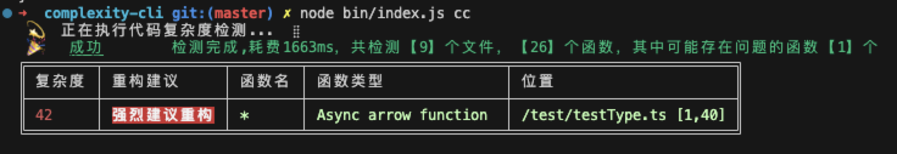
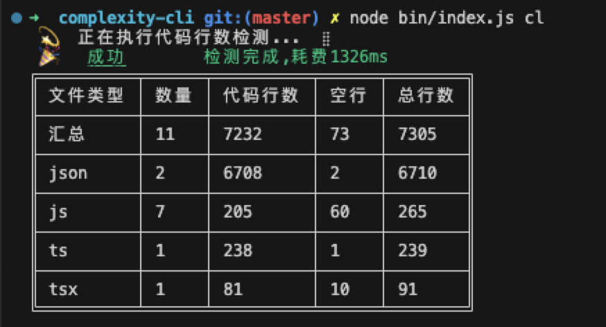

<p align="center">
  <a href="https://git.corp.kuaishou.com/ks-ad/ad-fe/infra/light/complexity-cli">
    
  </a>
</p>

<h1 align="center">complexity cli</h1>

<div align="center">

有趣又实用的命令行工具。


<div align="left">


## npm包

> 提供底层数据，可以灵活扩展。

### scan

代码扫描工具，详细文档：[ad-code-scan](./ad-code-scan/)

```js
npm i @ks-complex/code-scan --save
```

### ad-code-complexity

代码复杂度检测，详细文档：[ad-code-complexity](./ad-code-complexity/)

```js
npm i @ks-complex/code-complexity --save
```

### ad-code-line

代码行数统计工具，详细文档：[ad-code-line](./ad-code-line/)


## cli 工具

> 提供命令行可视化。


```js
npm i complexity-cli --g
```

- `cc` 代码复杂度统计

- `cl` 代码行数统计

### cc

切换到项目目录下，执行：

```js
complexity-cli cc
```



### cl

切换到项目目录下，执行：

```js
complexity-cli cl
```


